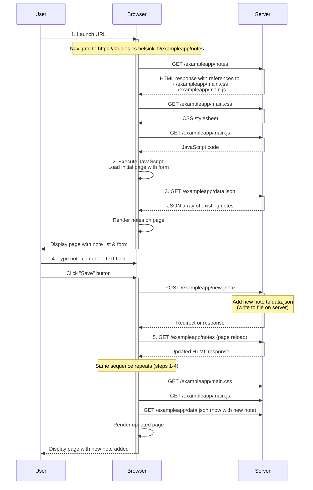

# Creating a New Note - Sequence Diagram

This diagram shows the interaction between the user, browser client, and server when creating a new note on https://studies.cs.helsinki.fi/exampleapp/notes

## New Note Creation Flow

## Sequence Breakdown

1. **Initialize Page**: User launches the URL, server responds with HTML containing CSS and JS references
2. **Load Resources**: Browser loads the CSS stylesheet and JavaScript code
3. **Load Data**: JavaScript makes XHR/Fetch request to get existing notes from data.json
4. **Save Note**: User enters note content and clicks Save, triggering POST to /exampleapp/new_note
   - Server appends the new note to the data.json file
   - Server responds with redirect/confirmation
5. **Reload**: Page reloads, repeating the initial sequence
   - Browser requests data.json again, which now includes the newly saved note
   - Updated note list is displayed to the user

---

**Note**: The example app uses a simple file-based storage (data.json) instead of a database for storing notes.