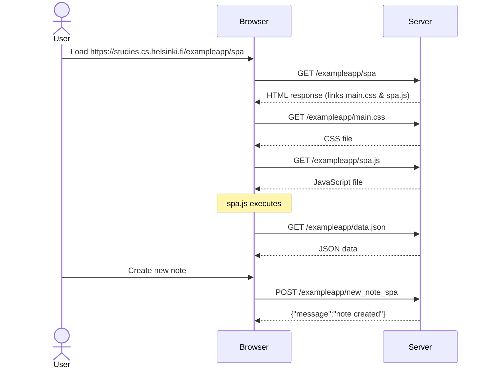

# SPA Sequence Diagram

```mermaid
sequenceDiagram
    actor User
    participant Browser
    participant Server

    User->>Browser: Load https://studies.cs.helsinki.fi/exampleapp/spa
    Browser->>Server: GET /exampleapp/spa
    Server-->>Browser: HTML response (links main.css & spa.js)
    
    Browser->>Server: GET /exampleapp/main.css
    Server-->>Browser: CSS file
    
    Browser->>Server: GET /exampleapp/spa.js
    Server-->>Browser: JavaScript file
    
    Note over Browser: spa.js executes
    Browser->>Server: GET /exampleapp/data.json
    Server-->>Browser: JSON data
    
    User->>Browser: Create new note
    Browser->>Server: POST /exampleapp/new_note_spa
    Server-->>Browser: {"message":"note created"}
```
